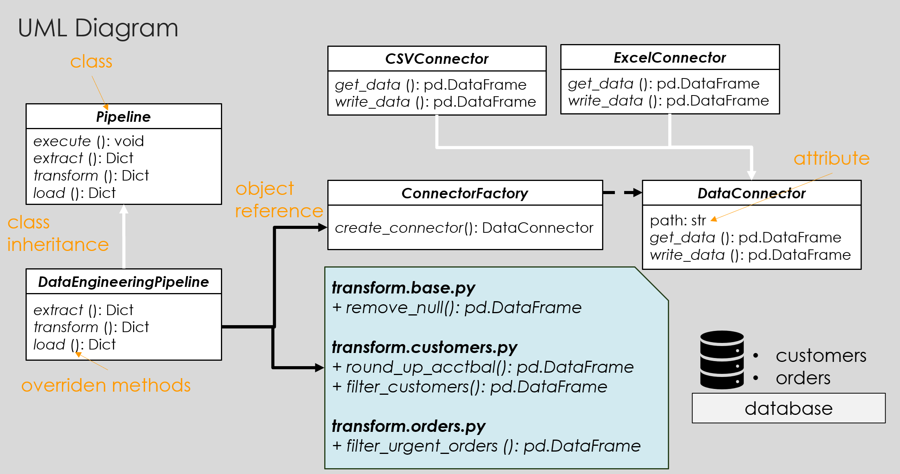

# clearpandas
Code sample to illustrate the programming style to make pandas code more readable. 
A detailed explanation can be found at [Placeholder website]()

## Prerequisites

Set up required packages presuming you're inside a virtual environment
```bash
python -m pip install virtualenv pip-tools
pip-compile -v --rebuild -o requirements.txt
pip-sync requirements.txt
python -m ipykernel install --user --name=clearpandas-kernel
```

## Demo

Access `notebooks\implement.ipynb` for code snippet:
```python
from clearpandas.pipeline.data_engineering import DataEngineeringPipeline
de_pipeline = DataEngineeringPipeline()
de_pipeline.execute()
```

Mockup data has been prepared using `notebooks\prep_data.ipynb`. 

## UML Class Diagram

The diagram illustrates how data and processing logic interact:
- **Data Read/Write**: `ConnectorFactory` instatiates a subclass `DataConnector` that abstracts the read/write process with SQL-query supported so the developer doesn't have to care about the underlying data type. SQL feature is made feasible by `duckdb` package.
- **Data Transformation**: all transformation methods are categorized into shareable (hence `base.py`) and table-specific operation; the latter is broken down further to actual table level, `customers` and `orders`. This ensures there is only one lookup place for table transformation and scope segregation could be done based on table name. All transformations are `pipe`d, hence intuitively process in the same sequence as they are listed: `round_up_acctbal()` then `filter_customers()`.
```python
customer_table = (
            data['customers']
            .pipe(customers_transform.round_up_acctbal)
            .pipe(customers_transform.filter_customers, max_custkey=1000)
            )
```
- **Data Pipeline**: `Pipeline` blueprints that all pipelines is an ETL (Extract, Transform, Load) process. Pipeline class `DataEngineeringPipeline` implements the actual data read/write/transform logic in the corresponding ETL block. Blocks passing data using a `dict` object whose key-value pair is table name and `pd.DataFrame`. Main script can simply construct the pipeline class and run the `excecute()` method.



## Contact
Email: hovinh39@gmail.com